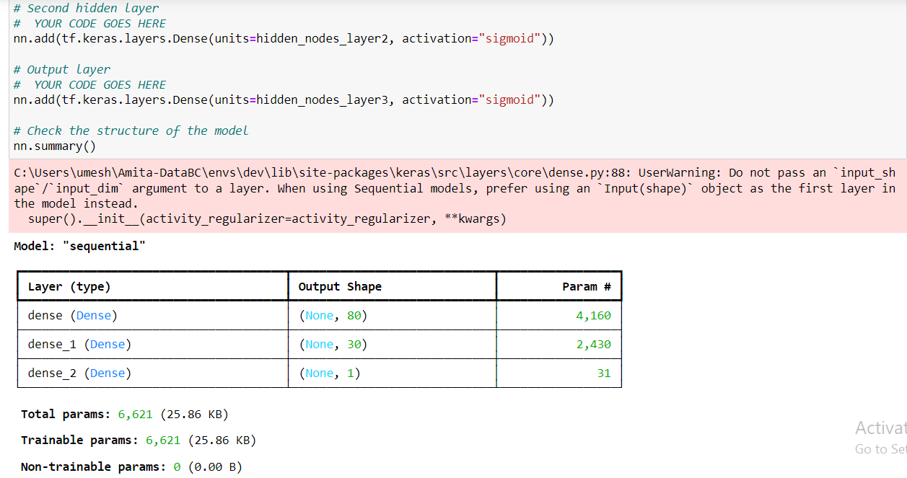

# deep-learning-challenge

# Scenario 1: Preprocess the Data
Using the knowledge of Pandas and scikit-learn’s StandardScaler(), I’ll need to preprocess the dataset. This step prepares you for Step 2, where you'll compile, train, and evaluate the neural network model.

Preprocessing Steps
Read in the charity_data.csv to a Pandas DataFrame, and be sure to identify the following in your dataset:
What variable(s) are the target(s) for your model?

IS_SUCCESSFUL is the target variable, as 1 indicates if the ASK_AMOUNT was successfully funded.
What variable(s) are the feature(s) for your model?

IS_SUCCESSFUL column is the featured chosen data for the model.
Drop the EIN and NAME columns.

Determine the number of unique values for each column.

For columns that have more than 10 unique values, determine the number of data points for each unique value.

Use the number of data points for each unique value to pick a cutoff point to bin "rare" categorical variables together in a new value, Other, and then check if the binning was successful.

Use pd.get_dummies() to encode categorical variables.

# Scenario 2: Compile, Train, and Evaluate the Model
Using your knowledge of TensorFlow, you’ll design a neural network, or deep learning model, to create a binary classification model that can predict if an Alphabet Soup–funded organization will be successful based on the features in the dataset. You’ll need to think about how many inputs there are before determining the number of neurons and layers in your model. Once you’ve completed that step, you’ll compile, train, and evaluate your binary classification model to calculate the model’s loss and accuracy.

Continue using the Jupyter Notebook in which you performed the preprocessing steps from Step 1.

Create a neural network model by assigning the number of input features and nodes for each layer using TensorFlow and Keras.

Create the first hidden layer and choose an appropriate activation function.

If necessary, add a second hidden layer with an appropriate activation function.

Create an output layer with an appropriate activation function.

Check the structure of the model.

Compile and train the model.

Create a callback that saves the model's weights every five epochs.

Evaluate the model using the test data to determine the loss and accuracy.

Save and export your results to an HDF5 file. Name the file AlphabetSoupCharity.h5.

# Scenario 3: Optimize the Model
Using your knowledge of TensorFlow, optimize your model to achieve a target predictive accuracy higher than 75%.

Using any or all of the following methods to optimize your model:

Adjust the input data to ensure that no variables or outliers are causing confusion in the model, such as:
Dropping more or fewer columns.
Creating more bins for rare occurrences in columns.
Increasing or decreasing the number of values for each bin.
Add more neurons to a hidden layer.
Add more hidden layers.
Use different activation functions for the hidden layers.
Add or reduce the number of epochs to the training regimen.
Note: If you make at least three attempts at optimizing your model, you will not lose points if your model does not achieve target performance.

Create a new Jupyter Notebook file and name it AlphabetSoupCharity_Optimzation.ipynb.

Import your dependencies and read in the charity_data.csv to a Pandas DataFrame.

Preprocess the dataset like you did in Step 1, Be sure to adjust for any modifications that came out of optimizing the model.

Design a neural network model, and be sure to adjust for modifications that will optimize the model to achieve higher than 75% accuracy.

Save and export your results to an HDF5 file. Name the file AlphabetSoupCharity_Optimization.h5.

Step 4: Write a Report on the Neural Network Model
For this part of the assignment, you’ll write a report on the performance of the deep learning model you created for AlphabetSoup.

The report should contain the following:

Overview of the analysis: Explain the purpose of this analysis.
The purpose of the charity funding analysis for Alphabet Soup was to predict where the company would approve/make investments. Our goal was to use machine learning and neural networks to apply target/features on the dataset, create a binary classifier that was capable of predicting whether investors would be successful if funded by Alphabet Soup. We started with 34,000 organizations and 12 columns that captured the metadata about each organization and their past funding outcomes.

Results: Using bulleted lists and images to support your answers, address the following questions.
Data Preprocessing

What variable(s) are the target(s) for your model?

IS_SUCCESSFUL is the target that is marked 1 for successful. The latter indicates that the company's past funding was successful.
What variable(s) are the features for your model?

IS_SUCCESSFUL, is the feature column chosen data for the model.
What variable(s) should be removed from the input data because they are neither targets nor features?

EIN and Name should be removed from the input data because they are neither targets nor features
Compiling, Training, and Evaluating the Model.

Summary: Summarize the overall results of the deep learning model. Include a recommendation for how a different model could solve this classification problem, and then explain your recommendation.
The model's best result employing the different numbers of neurons and layers was a 72.7% accuracy for the relu and sigmoid activations. Since the random forest classifier is less affected by outliers, it should be the next step. Recommendation: Reduce epoch between 20-50.